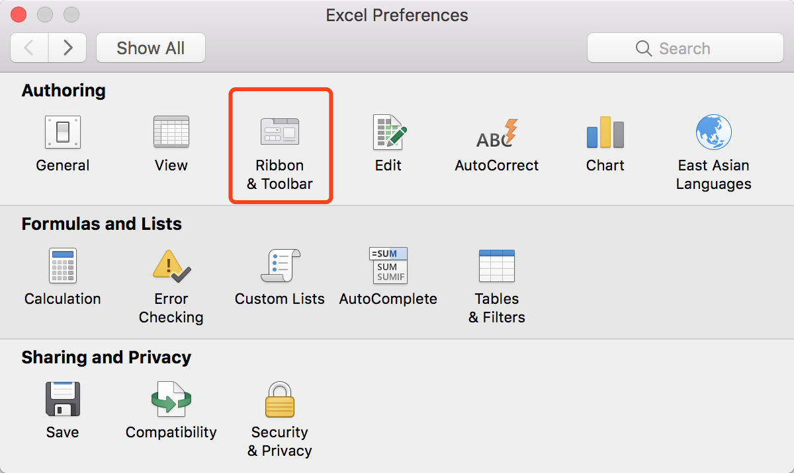
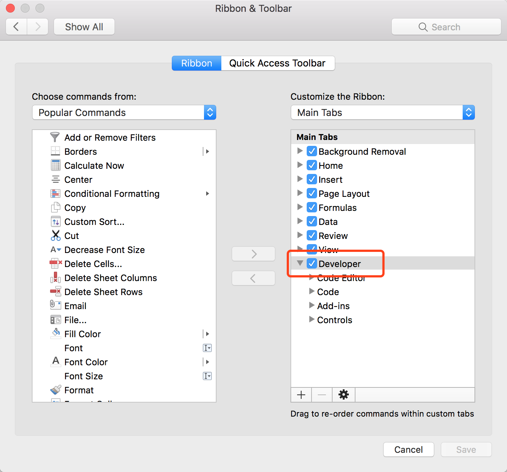
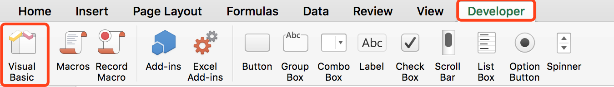
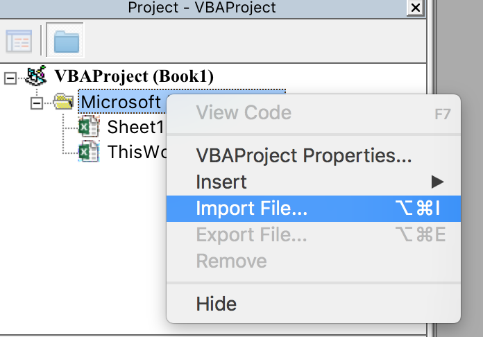
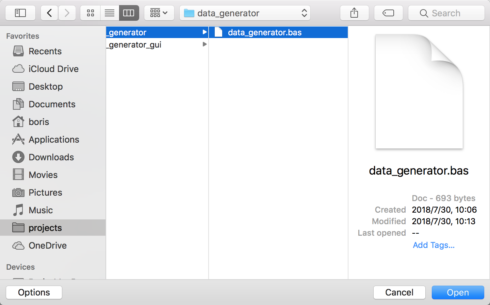
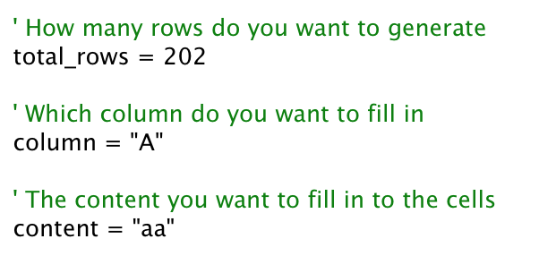
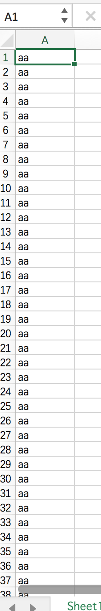
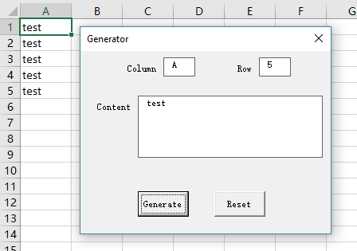

# Auto Filling Script For Excel
Generate a bunch of data in Excel with given content

---
## Files

- data_generator.bas: The data generator

- frmGenerator.frm and frmGenerator.frx: The GUI version of the generator

---

## How to enable the developer ribbon

### In the Windows version

Goto "File" -> "Options" -> "Customize Ribbon"

Under Customize the Ribbon and under Main Tabs, select the "Developer" check box

### In the Mac version
Goto "Excel" -> "Preferences" -> "Ribbon & Toolbar"

Then tick "Developer"

---

## How can I use this

### For the script version:

- Open the "Visual Basic" developing environment

- Import `data_generator.bas` in Excel VBA

- Edit the code to fit your requirements, or you can write your logic here

- And execute

- Then you can check if the result matches your requirement

### For the GUI version:

**Seems the UserForm won't work in the Mac version Office**

- Import `frmGenerator.frm` in Excel VBA
- Run the form and fill in the blanks
- Click "Generate"

---

## License
This source code is published under the WTFPL license. For detail, see [LICENSE](LICENSE) file. 